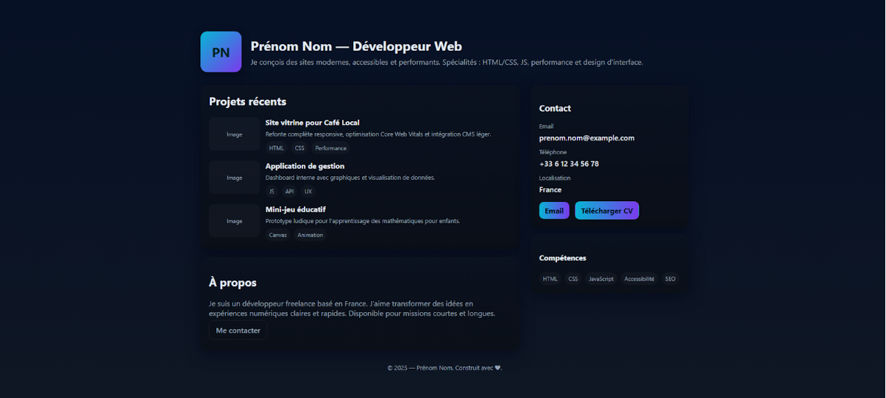
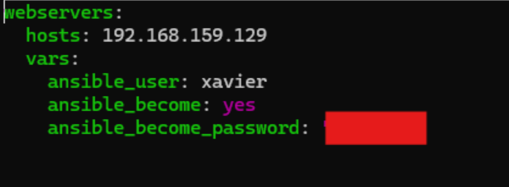

# Projet Ansible : Déploiement d’un site web avec Nginx

## 🎯 Objectif

Mettre en place un **playbook Ansible** capable de :

- Installer et configurer un serveur web **Nginx**
- Déployer un site web **HTML simple**
- S’assurer que le service Nginx reste actif
- Utiliser des **variables** et un **template Jinja2** pour automatiser le contenu

---

# 🏗️ Infrastructure

Deux machines :

- **Serveur** : machine où Ansible est installé  
- **Target** : machine cible recevant la configuration  

Réseau utilisé : **host-only → 192.168.159.0**

---

# 🔐 Préparation SSH

1. Génération d’une **clé SSH** sur le serveur
    ```bash
   ssh-keygen
   ```
2. Copie de la clé publique vers la target :  
   ```bash
   ssh-copy-id user@192.168.159.X
   ```
3. Test de connexion sans mot de passe :  
   ```bash
   ssh user@192.168.159.X
   ```

---

# 🌐 Site HTML à déployer

Le fichier `index.html` a été généré et sera déployé automatiquement sur la machine cible.


---

# 📁 Inventaire Ansible

Un fichier d’inventaire a été défini pour préciser :

- l’hôte cible (`webserver`)
- l’utilisateur
- son mot de passe initial



---

# 📜 Tâches du Playbook

Le playbook réalise les actions suivantes :

1. **Installer Nginx** (`state: present`)
2. **Démarrer Nginx** (`state: started`)
3. **Déployer le site HTML** dans `/var/www/html/index.html`
4. **Notifier un handler** pour redémarrer Nginx en cas de changement

Exemple simplifié :

```yaml
- name: Install and configure Nginx
  hosts: webservers
  
  tasks:
    - name : installation nginx
      apt :
        name : nginx
        state : present
    - name: Ensure Nginx is running
      service:
        name: nginx
        state: started
        enabled: yes

    - name: Deploy custom homepage
      copy:
        src: index.html
        dest: /var/www/html/index.html
      notify: Restart nginx
  handlers:
  - name: Restart nginx
    service:
      name: nginx
      state: restarted
```

---

# ▶️ Exécution du Playbook

Commande :

```bash
ansible-playbook playbook.yml -i inventory.yml
```

Chaque étape s’affiche clairement lors de l’exécution.

---

# 🔧 Passage à un Template Jinja2

Le site HTML est ensuite devenu **dynamique** :

- `index.html` remplacé par `index.j2`
- Variables définies dans `vars.yml`
- Module `template:` utilisé à la place de `copy:`

Exécution avec variables :

```bash
ansible-playbook site.yml -e @vars.yml
```

Le site est généré automatiquement selon les valeurs définies.

---

# ✅ Résumé Final

- Connexion SSH sans mot de passe opérationnelle  
- Playbook Ansible configuré pour installer et gérer Nginx  
- Déploiement d’un site web statique → puis dynamique avec Jinja2  
- Variables centralisées dans `vars.yml`  
- Déploiement automatisé en **une seule commande**

